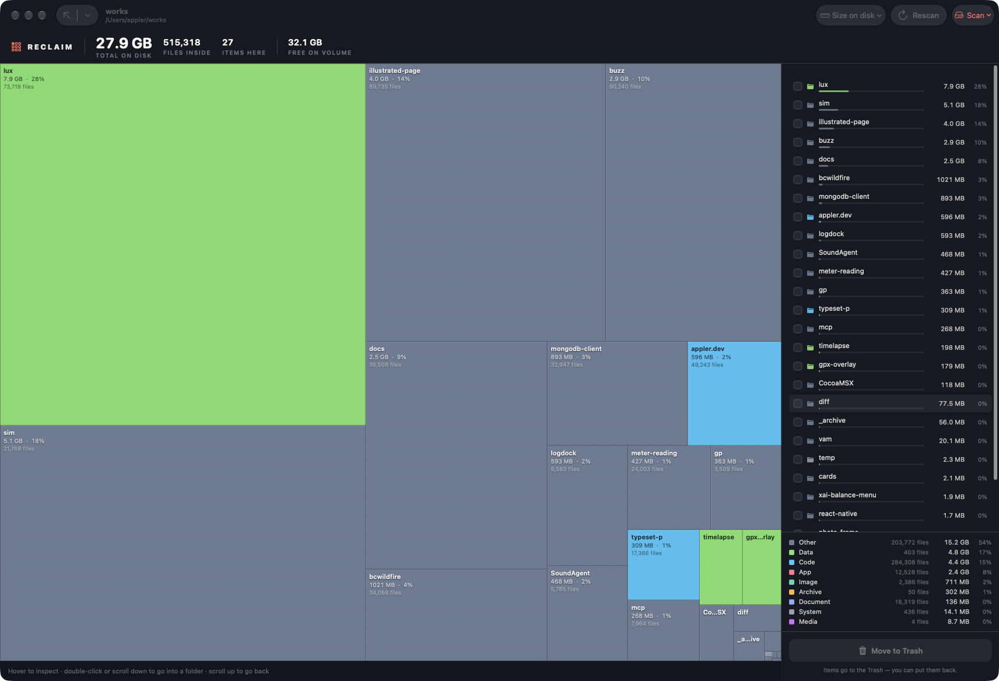

# Reclaim

A native macOS app that shows **where your disk space actually went** — and lets you
move things to the Trash yourself, on your own judgement.



It does not tell you what you should delete. It measures, shows, and gets out of the way.

## What it does

Pick a **volume** or a folder. Reclaim scans it and shows the folder you are looking at
as a single level of tiles, each sized by the space it takes:

- **One level at a time.** Every immediate child is one labelled tile — name, size,
  share of the folder, file count — instead of a mosaic of sub-pixel specks.
- **Watch it happen.** The map appears within milliseconds of starting a scan and fills
  in as it runs, tiles growing as bytes are found, with a progress bar counting folders.
- **Scroll to move through the tree.** Scroll down over a tile to go into it, scroll up
  to come back out; double-click, the list, **Up** and **⌘↑** all work too. Changing
  level zooms: the tile you enter grows into the whole view, and going back up shrinks
  the view into the tile it came from.
- **Colour says what kind of thing it is** — code, media, images, archives, documents,
  apps, data. A folder takes the colour of what it mostly holds.
- **One set of numbers**, in the strip at the top: the size of the folder in view, files
  inside, items here, then — set apart, because they describe something else — free space
  on the volume, what is sitting in the Trash, and how many directories could not be read.
- **The list is the same data, ranked**, largest first with share bars, and a by-type
  summary pinned below it. Drag the divider to resize; the width is remembered.
- **It remembers.** Every scan is recorded, so the next one can say what changed:
  `+25.0 MB` appears beside the folder that grew. History survives quitting, and the
  start screen lists what you scanned before.
- **Deleting is yours to start.** Tick anything in the list, or right-click a tile, and
  it goes to the **Trash** — `FileManager.trashItem`, never an outright delete. The
  button says how much it will move, the header shows what is in the Trash, and you can
  put any of it back.
- **A tab is a scan**, so one window can hold Macintosh HD and another `~/Library`.

## For agents

While the app is running it serves MCP on `http://127.0.0.1:8739/mcp` — loopback only,
since this hands out a map of the disk. Tools answer from the recorded history, so an
agent can ask what is taking up space and what has grown without anyone relaying
screenshots:

```sh
claude mcp add --transport http reclaim http://127.0.0.1:8739/mcp
```

`list_targets`, `disk_usage`, `largest_items`, `growth`, `scan_history`, and `scan_now`
for a folder with no history yet. The address is also on the File menu.

```
growth → total: +25.0 MB
         +25.0 MB  ~/Documents/project/build
```

## Build and run

```sh
./Scripts/build_app.sh          # → dist/Reclaim.app
open dist/Reclaim.app
```

The script builds a release binary, generates the icon, writes `Info.plist`, and signs
the bundle: with a `Developer ID Application` certificate plus hardened runtime and a
secure timestamp when one is in the keychain, ad-hoc otherwise.

```sh
TEAM_ID=XXXXXXXXXX BUNDLE_ID=com.example.reclaim ./Scripts/build_app.sh
./Scripts/notarize.sh           # after: xcrun notarytool store-credentials reclaim-notary …
```

### Permissions

Reclaim is deliberately **not sandboxed** — the point is to measure whatever you point it
at. macOS still prompts once for Desktop, Documents and Downloads. For a whole-disk scan,
grant **Full Disk Access** in System Settings → Privacy & Security. Anything unreadable is
counted and reported in the top strip rather than silently skipped.

### Terminal

The same engine runs headless, which is how the numbers below were measured:

```sh
Reclaim --volumes            # mounted volumes, used/free
Reclaim --scan <path>        # totals, contents largest-first, by-type summary
Reclaim --bench <path>       # layout time vs detail level
Reclaim --bench-draw <path>  # render time vs detail level
Reclaim --bench-nav <path>   # cost of drilling in and back out
Reclaim --open <path>        # launch the UI straight into a scan
```

## How it works, from the inside

| File | Role |
|---|---|
| `Scanner.swift` | Parallel directory walk: a LIFO queue feeds `4 × cores` workers, each directory read by exactly one worker so the tree needs no locks, then one iterative post-order pass sums sizes, counts files, and sorts every child list largest-first. Stays on one volume, counts hard links once, records logical and on-disk size, and reports per-branch progress so the map can be drawn while it runs. |
| `Treemap.swift` | Squarified layout (Bruls, Huizing & van Wijk), built by a class rather than a struct, over pre-sorted children. |
| `TreemapRenderer.swift` | Tile drawing with pre-resolved colours; shared by the view and the benchmarks. |
| `TreemapView.swift` | Live drawing, hit-testing, dirty-rect hover, context menu. No bitmap cache: the map is re-laid-out and redrawn at whatever size it is displayed at. |
| `ScrollNavigator.swift` | When a scroll gesture has earned a change of level — arithmetic over a delta and a timestamp, so the feel can be tested without synthetic events. |
| `Breakdown.swift` | Contents rows and per-type totals for the folder in view. |
| `Snapshot.swift`, `SnapshotStore.swift` | What each finished scan looked like, kept as JSON so history outlives the app. |
| `DiskQueries.swift`, `MCPEndpoint.swift`, `MCPServer.swift` | The MCP server: questions over the history, the JSON-RPC that answers them, and a loopback-only transport. |
| `Volumes.swift` | Mounted volumes with capacity and free space, refreshed on mount/unmount. |
| `AppModel.swift` | Scan lifecycle, navigation, selection, history, and the Trash operation. |
| `Log.swift`, `LogShipper.swift` | Ships structured logs to a local LogDock collector when one is running, tagged with version, build and commit. Inert when it is not. |

### Performance

Every number here was measured on `~/Library` (≈270k files), before and after, using the
benchmarks built into the binary. Nothing was optimised on a hunch.

| | before | after |
|---|---|---|
| Scan | 73 s (serial) | **2.5 s** (parallel workers) |
| Treemap layout | 436 ms | **3.2 ms** |
| Navigation step (layout + breakdown) | 88 ms worst | **0.55 ms worst** |
| Worst UI stall while navigating | 1078 ms | **38 ms** |
| Hover (pointer moving over the map) | full-window pass | **4 ms** |

Each came from a profile, not a guess:

- **Layout.** A sampling profile was almost entirely `swift_retain`/`swift_release` and
  `initializeWithCopy for TreemapCell`: the layout struct was copied on every recursive
  call and every directory re-sorted on every pass. Building into a class, sorting children
  once at scan time, and holding cells `unowned(unsafe)` removed it. Skipping folders whose
  children would each land on a fraction of a pixel cut cells 143k → 36k.
- **Navigation.** Each step re-classified every file below the folder, so filename parsing
  in `FileFamily.of` topped the profile. Folders now carry a per-family roll-up of bytes
  and counts, computed once and reused by their parents.
- **The UI itself.** `--stress-navigate` drives the real interface and times each step in
  three parts. That found `URL(fileURLWithPath:)` stat-ing the disk for every row tooltip,
  and hover changes invalidating the entire window. What remains is a ~10 ms SwiftUI pass
  the view tree costs even with no rows in it — the model update is 0.04 ms and the map
  draw is 0.01 ms.

Scan totals are byte-exact against `du -sk`.

## Tests

```sh
swift test        # 116 tests
```

They cover the parts that carry the numbers and the parts that are easy to get subtly
wrong: the scanner against real temporary directories (totals against `du`, hard links,
hidden files, unreadable directories, symlinks, cancellation), the layout (tiles cover
their parent with no gaps and no overlaps, sampled on a grid), live scanning (the first
level arrives before the scan returns, and the copy the UI draws shares no nodes with the
tree the workers are still mutating), scroll feel, trashing (bookkeeping without touching
the real Trash), history across sessions, and the MCP server end to end over a socket.

## Versioning and releases

The marketing version lives in `VERSION`, one line, edited by hand. The build number is
not kept anywhere: it is `git rev-list --count HEAD`, so it is monotonic, identical for
everyone who builds the same commit, and needs no state outside the repository. The commit
itself is recorded in the bundle as `ReclaimSourceCommit`, with `-dirty` appended when the
tree has uncommitted changes — a build always says exactly what it came from.

```sh
./Scripts/build_app.sh release
# built dist/Reclaim.app — version 1.0.0 (build 32, commit 55a249f)
```

To release: bump `VERSION`, commit, and push a matching tag.

```sh
echo 1.1.0 > VERSION && git commit -am "release 1.1.0" && git tag v1.1.0 && git push --tags
```

`.github/workflows/release.yml` refuses to build a tag that disagrees with `VERSION`,
then tests, builds, signs, notarizes, and attaches a zip to the GitHub release.
`.github/workflows/ci.yml` tests and builds every push. Both use a full checkout, since a
shallow clone would number every build 1.

Signing and notarizing in CI are optional and driven by repository secrets; with none set
the workflow still produces an ad-hoc signed app, which runs locally but shows Gatekeeper's
unidentified-developer warning.

| Secret | For |
|---|---|
| `DEVELOPER_ID_P12` | base64 of the exported Developer ID certificate (.p12) |
| `P12_PASSWORD` | its export password |
| `TEAM_ID` | the signing team |
| `NOTARY_APPLE_ID`, `NOTARY_PASSWORD` | notarization (app-specific password) |

## Requirements

macOS 14 or later, and a Swift 6 toolchain (Xcode 16+) to build. **No package
dependencies:** the app speaks MCP with its own JSON-RPC and talks to LogDock over plain
HTTP, so a fresh clone builds on its own.
